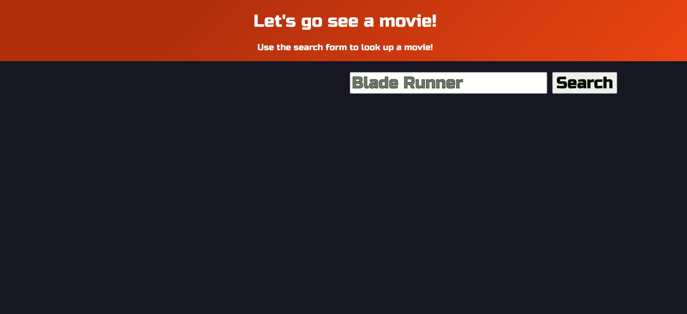
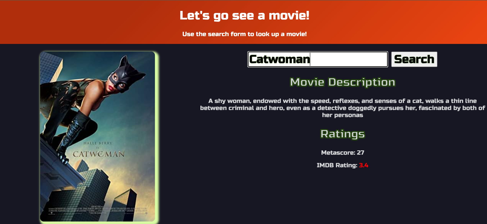

# Project1- My MDb :movie_camera:	

## Description 
For this group project we decided to create a movie database access page. This application allows the user the input a movie title into the search form to get random trivia of the movie and its ratings. This helps the user decide if this is a movie they would want to watch based on the output. 

While working on this project we learned how to collaborate and solve issues and resolve any obstacles that came up. 

## Features :clapper:
To assist the user, the ratings number changes color based on the ratings.

- Higher rated films are green
- Middle rated films are orange
- Low rated films are red

## Deployed Link

See the deployed application here 
[My MDb](https://walkerjezek.github.io/Project1/ "My MDb") 

## Contributers

- Ryann Goldberg (ryann127)
- Walker Jezek (walkerjezek)
- Anita Chavez (Neeta525)

## Technologies Used
- HTML
- CSS
- JavaScript

## Screenshots :camera_flash:

## License

The MIT License (MIT)

Copyright (c) 2022 Walker Jezek, Ryann Goldberg, Anita Chavez

Permission is hereby granted, free of charge, to any person obtaining a copy of this software and associated documentation files (the "Software"), to deal in the Software without restriction, including without limitation the rights to use, copy, modify, merge, publish, distribute, sublicense, and/or sell copies of the Software, and to permit persons to whom the Software is furnished to do so, subject to the following conditions:

The above copyright notice and this permission notice shall be included in all copies or substantial portions of the Software.

THE SOFTWARE IS PROVIDED "AS IS", WITHOUT WARRANTY OF ANY KIND, EXPRESS OR IMPLIED, INCLUDING BUT NOT LIMITED TO THE WARRANTIES OF MERCHANTABILITY, FITNESS FOR A PARTICULAR PURPOSE AND NONINFRINGEMENT. IN NO EVENT SHALL THE AUTHORS OR COPYRIGHT HOLDERS BE LIABLE FOR ANY CLAIM, DAMAGES OR OTHER LIABILITY, WHETHER IN AN ACTION OF CONTRACT, TORT OR OTHERWISE, ARISING FROM, OUT OF OR IN CONNECTION WITH THE SOFTWARE OR THE USE OR OTHER DEALINGS IN THE SOFTWARE.

